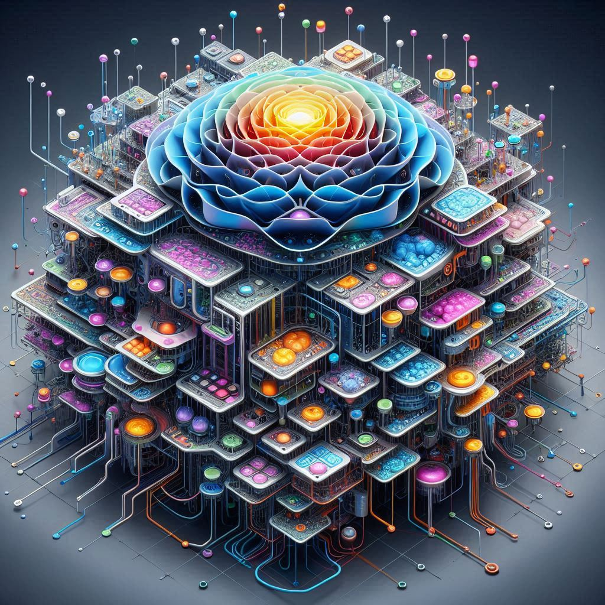

# A Hybrid Deep Learning Model for Optimizing Particle Identification Systems

This project presents a novel hybrid algorithm that combines the power of a deep neural network (DNN) with a random forest regressor (RFR) to effectively enhance PID tasks within the experiment.

## Project Objectives:
-----

The primary objectives of this project are as follows:

1. Development of Hybrid Model: The project will focus on designing and implementing a hybrid machine learning model that seamlessly integrates a deep neural network (DNN) and a random forest regressor (RFR). This hybrid model will be customized to excel in performing PID tasks within the Belle II Experiment.

2. Leveraging Complementary Strengths: The hybrid model's architecture will be designed to harness the unique strengths of both the DNN and RFR techniques. By combining these approaches, the model will offer robust regression capabilities for improved PID.

3. Comprehensive Evaluation: The project will conduct a thorough evaluation of the hybrid model's performance. This assessment will include various benchmarks and metrics to ensure that the model effectively enhances particle discrimination and increases the precision of the PID system.

Expected Outcomes:
The anticipated outcomes of this project are as follows:

*i.* Enhanced Particle Discrimination: The hybrid model is expected to significantly improve the ability to distinguish and identify particles within the Belle II Experiment, leading to more accurate and reliable results.

*ii.* Improved PID System Precision: The project aims to increase the precision of the Particle Identification (PID) system, reducing errors and uncertainties in experimental data.

## Significance of the Project:
This project is of paramount importance for high-energy physics experiments such as the Belle II Experiment. By introducing a hybrid machine learning model tailored to PID tasks, it not only enhances the scientific quality of the experiment but also contributes to the broader field of particle physics. The optimized PID system will enable researchers to extract more precise information from the data, potentially leading to groundbreaking discoveries and a deeper understanding of the fundamental particles and forces that govern our universe.
Conclusion:
In summary, this project introduces a cutting-edge machine learning approach to optimize Particle Identification within the Belle II Experiment. By combining a deep neural network and a random forest regressor into a hybrid model, the project aims to enhance particle discrimination and improve the PID system's precision. The outcomes of this research have the potential to significantly impact the field of particle physics and contribute to the ongoing quest for a more comprehensive understanding of the fundamental building blocks of the universe.
